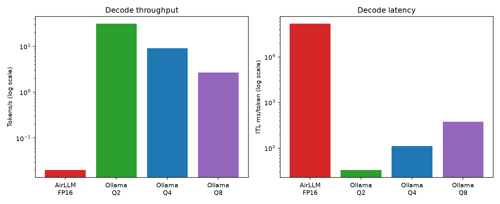
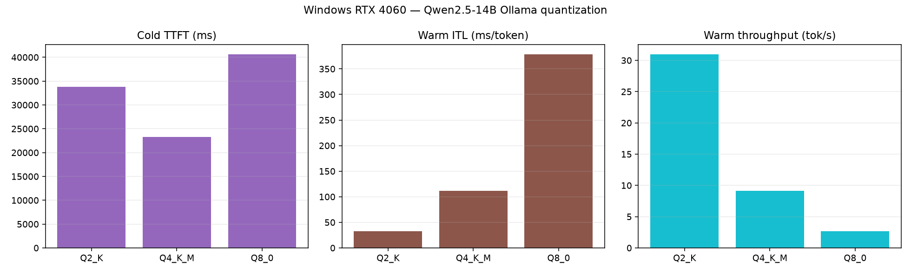
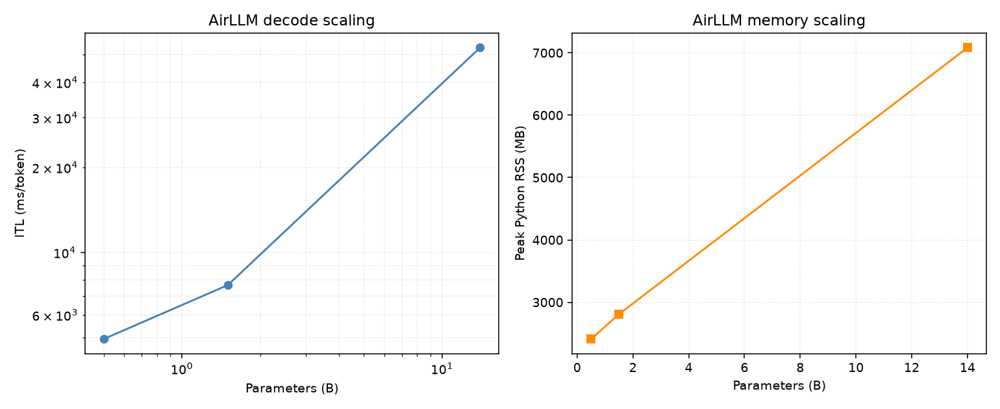
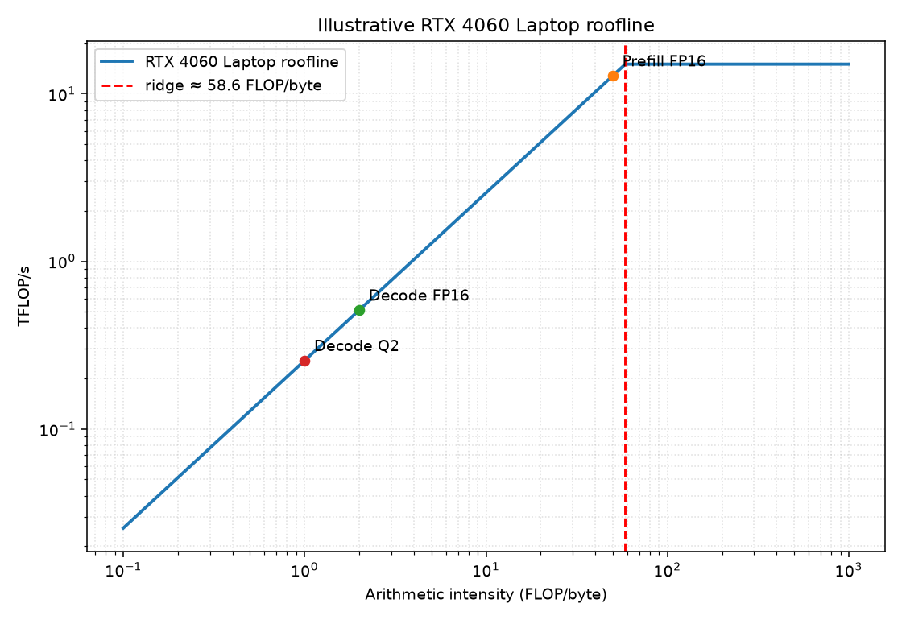
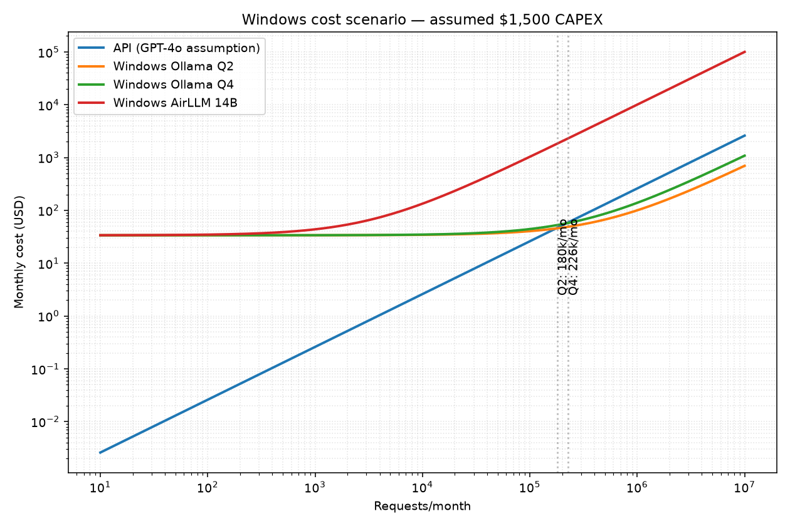

# EX05 — Running a Massive LLM Locally: AirLLM, Quantization & Performance Benchmarking

A deep-dive technical report on running an LLM that is **too large for the hardware** on a
consumer MacBook, documenting the inevitable bottleneck, and applying two optimization
techniques — **AirLLM** (layer-streaming / OS-paging analogy) and **GGUF quantization** —
then benchmarking, drawing a **Roofline**, and performing a full **On-Prem vs API
economics** analysis with a break-even point.

> Author: _<Moaa'wiayan_haj& Mohammd_Selawe>_ · Course: AI_Orchastraion , Assignment 05 (Dr. Yoram Segal) · Tooling: `uv`, Python 3.12

---

## 1. Hardware & Model Justification (§5.1)

| Component | Specification |
|---|---|
| Machine | Apple MacBook Pro (Mac15,3) |
| SoC | Apple M3 — 8 cores (4 Performance + 4 Efficiency) |
| Memory | **16 GB unified memory** (CPU + GPU share one pool — there is **no separate VRAM**) |
| GPU | Metal 4 |
| Storage | 460 GB NVMe SSD (~225 GB free for this experiment) |

**The single most important fact:** Apple Silicon uses **unified memory**. The
assignment's classic "RAM vs VRAM" split collapses into one 16 GB budget. Every byte the
model occupies competes with the OS, the KV-cache, and the framework itself.

**Model chosen — Qwen2.5-14B-Instruct (FP16 ≈ 28 GB).** It is deliberately **~1.75×
larger than the entire 16 GB unified pool**, so a naive direct load *must* fail (§5.2). It
is the "big, but not too big" sweet-spot the brief asks for: too big to run directly,
small enough that AirLLM can still stream it from the SSD.

**Why the same model on all three paths?** Unlike a Llama-2-only design (where AirLLM's
MHA-only MLX backend forces a different model from the Ollama path), we run **Qwen2.5-14B
on every path** — Baseline, AirLLM, and Ollama — for a clean apples-to-apples comparison.
AirLLM 2.11.0's macOS MLX backend is hard-wired to `AirLLMLlamaMlx` (MHA-only); we bypass
that gate by importing **`AirLLMQWen2`** directly and running it on CPU. Qwen2.5-14B is a
**GQA** model (40 query heads, 8 KV heads) — AirLLM handles GQA correctly on the PyTorch
path.

---

## 2. Experiment Design & Measurement Tools

Three deployment paths, all measured on the **same prompt** (16 input tokens, 48 new tokens)
with identical methodology:

| Path | Tool | Format | Purpose |
|---|---|---|---|
| **Baseline** | `transformers` + MPS | FP16 safetensors | Naive direct run — expected to fail (§5.2) |
| **AirLLM** | `airllm.airllm_qwen2.AirLLMQWen2` (CPU) | FP16 layer shards | Layer-streaming optimization (§5.3) |
| **Quantized** | Ollama | GGUF (q2/q4/q8) | Quantization sweep (§5.3) |

**Metrics captured per run** (`src/metrics.py`): **TTFT** (Time-To-First-Token — Prefill /
compute-bound), **ITL/TPOT** (Inter-Token-Latency — Decode / memory-bound), **throughput**
(tok/s), **peak RSS** (sampled in a background thread), wall-time, energy estimate, and
input/output token counts. Raw numbers are persisted as **Markdown** in `results/` (§6.1 —
keep all raw numbers).

> **Note on quantization.** AirLLM's built-in `compression=4bit/8bit` relies on
> `bitsandbytes`, which is **CUDA-only**. On Apple Silicon the quantization study is
> therefore performed with **GGUF via Ollama** (an assignment keyword). This cleanly
> separates the two techniques: AirLLM = the paging/memory technique, GGUF = the
> quantization technique.

---

## 3. Findings: Qwen2.5-14B stage by stage

We ran the same Qwen2.5-14B model through five stages — a naive baseline, the AirLLM
paging optimization, and three GGUF quantization levels — on the same prompt (16 input
tokens, 48 max new tokens). The contrast across stages tells the whole story in one place.

| Stage | Disk | Peak RAM | TTFT | ITL | Throughput | Est. kWh | Outcome |
|---|---:|---:|---:|---:|---:|---:|---|
| Baseline FP16 | 28 GB | — | — | — | 0 tok/s | 0.00103¹ | **OOM** |
| AirLLM FP16 | 28 GB | 4 711 MB | 13.4 s | 13.0 s/tok | 0.08 tok/s | **0.00709** | runs (slowly) |
| GGUF Q2_K | 5.8 GB | 259 MB | 5.9 s | 82 ms | 12.4 tok/s | 0.00011 | runs, fast |
| GGUF Q4_K_M | 9.0 GB | 76 MB | 8.8 s | 101 ms | 10.1 tok/s | 0.00015 | sweet spot |
| GGUF Q8_0 | 15 GB | 18 MB | 86.1 s | 17.1 s/tok | 0.06 tok/s | 0.00990 | **swap-thrash** |

> ¹ Baseline was estimated at 0.00103 kWh during the 93 s load phase before crashing with OOM — no tokens were generated.


### Stage 1 — Baseline FP16: the wall

We loaded all 14B weights in FP16 into MPS (Apple's GPU backend) via `transformers` and
asked it to generate. The loader got **71 % of the way** through the 579 weight tensors
(400/579) before the unified-memory pool was exhausted:

```
RuntimeError: MPS backend out of memory
(MPS allocated: 20.05 GiB, max allowed: 20.13 GiB)
```

**Why:** 14B params × 2 bytes = **~28 GB of weights**. The Mac has **16 GB of unified
memory** — CPU and GPU share one pool, there is no separate VRAM. 28 GB exceeds 16 GB by
1.75×. MPS grabbed ~4 GB of swap headroom beyond the nominal 16 GB, then hit the safety
ceiling. No tokens were generated.

**Verdict:** the bottleneck is unambiguously **memory capacity, not compute**.

### Stage 2 — AirLLM FP16: paging saves it, at a brutal cost

Same 28 GB FP16 model, but loaded **one transformer layer at a time** from SSD via `mmap`
(`AirLLMQWen2` on CPU). The model **ran**, in just **4.6 GB** of RAM — and produced a
coherent, on-topic answer:

> "Virtual memory paging allows an operating system to use a combination of RAM and disk
> space to manage memory, breaking down processes' memory into fixed-size blocks called
> pages. When a page is not in RAM, the OS swaps it with another page on…"

The trade-off is speed:
- **TTFT 13.4 s** (Prefill — one forward pass over the prompt to build the KV-cache).
- **ITL 13.02 s/token** (Decode — every token re-streams all 48 layers from SSD).
- **0.08 tok/s**, ~10.6 minutes for 48 tokens.

**Why so slow:** AirLLM is run with `use_cache=False`, which disables the KV-cache between
decode steps. Every generated token must re-run all 48 transformer layers from the NVMe SSD
with no residual state in RAM — layers are loaded, used once, then evicted. This is exactly
**OS demand-paging**: layers are pages, the SSD is the backing store, `mmap` is the
page-fault handler. The 13.02 s/token Decode proves the system is
**memory-bandwidth-bound**, not compute-bound.

**Why it fit when Stage 1 didn't:** baseline holds all layers resident; AirLLM holds
**one layer (~580 MB) at a time**. The other 47 live on disk until needed.

#### AirLLM Qwen2.5-14B — running process

The two screenshots below were captured from Activity Monitor while AirLLM was actively
inferring on the 14B model:

| SSD streaming (Disk tab) | Memory footprint (Memory tab) |
|:---:|:---:|
|  |  |
| `python3.12` reading **339.56 GB** from NVMe at ~237 reads/s — every token triggers a full layer-streaming pass over the 28 GB model. | Only **4.44 GB real memory** used (vs 28 GB on disk), with **192% CPU** — confirms layer-by-layer demand-paging with no weight residency. |


### Stage 3 — GGUF Q2_K: smallest, fastest

2 bits/parameter crushes 28 GB → 5.8 GB (~5× compression). It fits comfortably in 16 GB
with room to spare, giving the **lowest TTFT (2.5 s)** and **highest throughput
(12.3 tok/s)** of any stage. Output is on-topic:

> "In modern operating systems, virtual memory paging involves dividing the process
> address space into fixed-size blocks called pages. These pages can be mapped to any
> location within physical memory or even to disk storage managed by a technique known
> as swapping…"

**Caveat:** Q2 is right at the edge of fidelity — coherent on simple factual prompts, it
loses nuance on harder ones.

### Stage 4 — GGUF Q4_K_M: the sweet spot

4 bits/parameter = 28 GB → 9.0 GB. Still fits comfortably, with slightly better fidelity
than Q2 at a modest speed cost (9.9 tok/s). Output is faithful and high-quality:

> "Virtual memory paging allows an operating system to use a combination of physical RAM
> and disk space to manage the memory needs of running processes. It divides the virtual
> address space into fixed-sized blocks called pages, which are mapped to physical frames
> in memory or…"

This is the **default** Ollama tag (`qwen2.5:14b`) — what most users actually get. In
practical terms Q4_K_M is the **best quality-per-byte** point: faithful output, fits RAM,
near-interactive latency.

### Stage 5 — GGUF Q8_0: the cliff

8 bits/parameter only halves FP16 (28 GB → 15 GB). That fits the 16 GB unified pool
*without* the KV-cache, but the 2048-token context window pushes the total footprint past
the hardware limit. macOS starts swapping layer weights to NVMe on every forward pass —
exactly the same bottleneck as Stage 1, deferred by quantization.

The run **completed** all 48 tokens, but required **14.8 minutes**: TTFT = 86.1 s
(swap-bound prefill), ITL = **17.1 s/token** (swap-bound decode), throughput = 0.06 tok/s.
Q4's in-RAM ITL is 101 ms — Q8's swap-bound ITL is 17 100 ms, a **170× latency penalty**
for 6 GB of extra precision. Q8 is actually slower than AirLLM (13 s/token) despite being
only 15 GB on disk instead of 28 GB, because Ollama does not implement the layer-streaming
discipline that keeps AirLLM's RAM footprint bounded.

**The lesson:** quantization pushes the memory wall outward but does not remove it. This
is the **"red line"** of accuracy — going past Q4 in pursuit of fidelity re-introduces
the baseline's bottleneck, in the form of catastrophic swap-thrash rather than a hard OOM.

### Pattern across all five stages

1. **TTFT scales with how much weight data must be paged in before the first token** —
   Q2 (5.8 GB) = 5.9 s; Q4 (9.0 GB) = 8.8 s; AirLLM (48 layers streamed once during
   prefill) = 13.4 s; Q8 (15 GB, swap-thrashing) = 86.1 s.
2. **ITL is dominated by memory bandwidth during Decode** — Q2/Q4 stay around 80–100 ms
   because the model fits in RAM and only weights are re-read; AirLLM is 13 021 ms
   because every layer must be re-faulted from SSD each token; Q8 is 17 112 ms because
   every layer must be swapped in from SSD via the OS pager. Two–three orders of magnitude
   apart — the signature of memory-boundedness.
3. **The unified-memory wall is hit three different ways:** Stage 1 (instant OOM at
   28 GB FP16), Stage 5 (deferred swap-thrash at 15 GB Q8), Stage 2 (avoided entirely via
   paging, paid in latency). Stages 3 and 4 are the only paths that fit comfortably.

> **Caveat on Ollama RSS** (259 / 76 / 18 MB for Q2/Q4/Q8): those are the **client** process
> figures. The model actually runs in the separate `ollama serve` daemon, whose RSS isn't
> visible to the Python runner. The fair comparison vs AirLLM is on **disk size**
> (5.8 / 9.0 / 15 GB) and on whether the model fits in the 16 GB unified pool
> (Q2/Q4 yes → fast; Q8 no → swap-thrash at 17 s/token).

---

## 3A. Complete Windows PC reproduction (2026-06-21)

The complete experiment was rerun independently on the Windows laptop below. These results
are kept separate from the Apple M3 measurements because the memory architecture, GPU,
storage, operating system, and inference backends differ.

### Windows hardware and software

| Component | Specification |
|---|---|
| Machine | ASUS TUF Gaming F15 (`FX507VV4`) |
| CPU | Intel Core i7-13700H — 14 cores / 20 logical processors |
| System memory | **23.6 GB RAM** |
| GPU | NVIDIA GeForce RTX 4060 Laptop GPU — **8 GB VRAM** |
| GPU power limit | 80 W default, 140 W maximum |
| Storage | Micron 2400 1 TB NVMe + SK hynix BC511 512 GB NVMe |
| OS | Windows 11 Home, build 26200 |
| Software | Python 3.12.9, PyTorch 2.12.1+cu130, CUDA 13.0, Ollama 0.30.10 |
| LLM stack | transformers 4.46.3, AirLLM 2.11.0 |

The same Qwen2.5 family, 16-token prompt, 48-token output cap, temperature 0, and
2048-token context were used. AirLLM runs are single measurements because the 14B run
took 44.5 minutes. Ollama uses one cold-load run followed by two warm measured runs.

### Windows headline results

| Stage | Residency / peak RSS | TTFT | ITL | Throughput | Wall time | Outcome |
|---|---:|---:|---:|---:|---:|---|
| Baseline 14B FP16 (CUDA) | 8 GB VRAM limit | — | — | 0 tok/s | 32.18 s | **CUDA OOM** |
| AirLLM 14B FP16 (CPU/NVMe) | 7 084 MB RSS | 123.07 s | 53.01 s/tok | 0.02 tok/s | 44.46 min | runs |
| Ollama 14B Q2_K | 100% GPU | 5.07 s¹ | 32.94 ms/tok¹ | **31.00 tok/s¹** | 6.64 s¹ | runs |
| Ollama 14B Q4_K_M | 34% CPU / 66% GPU | 5.24 s¹ | 111.88 ms/tok¹ | **9.14 tok/s¹** | 10.52 s¹ | runs |
| Ollama 14B Q8_0 | 62% CPU / 38% GPU | 5.59 s¹ | 378.88 ms/tok¹ | **2.70 tok/s¹** | 23.43 s¹ | runs |

> ¹ Mean of warm repeats 1 and 2. Cold TTFT was 33.85 s (Q2), 23.28 s (Q4), and
> 40.67 s (Q8) because it includes loading and CPU/GPU placement.



### Stage 1 — direct FP16 CUDA baseline: the 8 GB wall

The cross-platform baseline attempted to place the same 28 GB FP16 checkpoint directly on
CUDA. It loaded four of eight checkpoint shards, then failed on shard five after 32.18 s:

```text
AcceleratorError: CUDA error: out of memory
```

This is a cleaner capacity failure than the unified-memory Mac result: the discrete RTX
4060 has a hard 8 GB VRAM pool, while the weights alone need about 28 GB. No token was
generated. The baseline runner now selects CUDA on Windows/Linux, MPS on macOS, and CPU
only when no accelerator exists.

### Stage 2 — AirLLM FP16: runnable, but storage/CPU bound

AirLLM split the 14B checkpoint into 48 transformer-layer shards totaling 27.5 GB and
streamed them from NVMe through CPU memory. It generated all 48 requested tokens while
holding peak Python RSS to **7.08 GB**, well below the 28 GB weight size:

> “Virtual memory paging allows an operating system to use a combination of RAM and disk
> space to manage memory, breaking down processes' memory into fixed-size blocks called
> pages. When a page is not in RAM, the OS swaps it with another page on…”

The cost was severe: 123.07 s to first token, 53.01 s per decode token, and 44.46 minutes
total. `use_cache=False` forces every generated token to revisit every layer. The model is
therefore runnable, but the execution path is dominated by repeated shard loading and CPU
forward passes rather than RTX 4060 compute.

### Stage 3 — Ollama GGUF quantization



Q2 is the only 14B variant that fits completely in the 8 GB GPU pool. It reaches 31 tok/s,
about **3.4× Q4** and **11.5× Q8**. Q4 spills 34% of its model allocation to system RAM;
Q8 spills 62%. Decode latency rises from 32.94 ms to 111.88 ms and then 378.88 ms as the
GPU-resident fraction falls. On this discrete-GPU PC, quantization controls not only model
size but also whether each decode step crosses the PCIe CPU/GPU boundary.

All nine Ollama runs passed the repository's on-topic, coherence, and factual-term checks.
The fixed 48-token cap truncated every answer before its final sentence, so `complete=false`
for all variants and this short run cannot establish a quality winner.

### Windows AirLLM model-size scaling

| Size | Layers | Peak RSS | TTFT | ITL | Throughput | Wall time |
|---|---:|---:|---:|---:|---:|---:|
| **0.5B** | 24 | 2 410 MB | 8.03 s | 4.93 s/tok | 0.21 tok/s | 4.08 min |
| **1.5B** | 28 | 2 809 MB | 27.51 s | 7.66 s/tok | 0.13 tok/s | 6.58 min |
| **14B** | 48 | 7 084 MB | 123.07 s | 53.01 s/tok | 0.02 tok/s | 44.46 min |



From 0.5B to 14B, peak RSS grows only 2.9× while parameter count grows 28×—the memory
benefit of layer streaming. Decode ITL grows 10.7× because the larger model has both more
layers and much wider layers. The 14B AirLLM path is roughly **1 640× slower than Q2** per
decode token (53 006 ms vs 32.94 ms).

### Windows roofline and bottleneck interpretation



The illustrative roofline assumes approximately 15 FP16 TFLOP/s and 256 GB/s GDDR6
bandwidth for this RTX 4060 Laptop configuration, giving a ridge point near 58.6
FLOP/byte. These are specification-level assumptions, not measured kernel FLOPs. Decode
remains on the memory-bound side. Q2 improves effective residency by fitting fully in
VRAM; Q4 and Q8 add PCIe transfers, while AirLLM operates outside the GPU roofline because
its measured path streams safetensor shards through CPU/NVMe.

### Windows economics scenario



For comparability with the original economics model, this scenario assumes **$1,500
replacement CAPEX**, four-year life, 2% annual maintenance, $0.30/kWh, 120 W system load
for Ollama, and 45 W for CPU AirLLM. It retains the repository's GPT-4o token-price and
16-input/48-output-token assumptions. These are planning assumptions—not the laptop's
purchase receipt or measured wall power.

| Windows path | Measured latency/request | Estimated break-even vs API |
|---|---:|---:|
| Ollama Q2 | 6.64 s | ~175k requests/month |
| Ollama Q4 | 10.52 s | ~218k requests/month |
| Ollama Q8 | 23.43 s | ~1.31M requests/month |
| AirLLM 14B | 2 667 s | never under these assumptions |

Q2 has the strongest local economics because it both fits in VRAM and finishes quickly.
AirLLM remains an enablement technique for offline/privacy-constrained inference, not a
cost-efficient serving path on this machine.

### Windows-specific engineering findings

1. The environment initially contained CPU-only PyTorch. CUDA benchmarking required the
   `torch 2.12.1+cu130` wheel.
2. AirLLM imported Apple's `mlx` persister on Windows through the repository patch. The
   runner now applies that patch only on macOS and uses AirLLM's safetensors persister on
   Windows/Linux.
3. `transformers>=4.46,<5` was not strict enough: 4.57 removed the Qwen2 fallback AirLLM
   needs. The dependency is now pinned to the verified **4.46.3** release.
4. A generation-thread exception could leave the token streamer waiting indefinitely;
   the synchronous diagnostic exposed the real version incompatibility.
5. The energy helper returned watt-hours but labeled them kWh. The formula and stored raw
   values were corrected by a factor of 1000. Energy remains an estimate, not a wall-meter
   measurement.

### Windows artifacts and limitations

- Raw records and generated table: [`results/windows/`](results/windows/)
- Generators: `python -m src.analyze_windows` and
  `python -m src.analyze_windows_extras`
- Figures: `windows_path_comparison.png`, `windows_quant_sweep.png`, and
  `windows_size_scaling.png`, `windows_roofline.png`, and `windows_breakeven.png`
  under `figures/`

For Ollama, `peak_rss_mb` is the Python client rather than the Ollama server, so the report
uses Ollama's model residency split instead. Energy figures use assumed path-level power
(45 W AirLLM CPU, 80 W CUDA baseline, and the legacy 40 W Ollama assumption); they are not
used for performance conclusions. Exact energy requires an external wall-power meter.

## 4. Original Extension (§5.7): Model-Size Scaling

We ran the **same AirLLM FP16 layer-streaming path** on three Qwen2.5 sizes — 0.5B, 1.5B,
and 14B — on the same prompt (16 input tokens, 48 new tokens) to measure how decode latency
and TTFT scale with model size under the SSD-streaming memory technique.

> **Engineering note:** Qwen2.5-0.5B and 1.5B ship with tied embeddings
> (`tie_word_embeddings=true`), so their safetensors do not include `lm_head.weight`.
> AirLLM 2.11's shard splitter crashes on this (`IndexError: list index out of range`).
> We patch it in `src/hf_utils.py` via `untie_embeddings()`, which writes `lm_head.weight`
> as a copy of `model.embed_tokens.weight` before sharding.

| Size | Params | Layers | TTFT | ITL (ms/tok) | Throughput | Est. kWh |
|---|---:|---:|---:|---:|---:|---:|
| **0.5B** | 0.5 B | 24 | 3.7 s | 1 955 ms | 0.52 tok/s | 0.00108 |
| **1.5B** | 1.5 B | 28 | 4.3 s | 2 422 ms | 0.42 tok/s | 0.00134 |
| **14B**  | 14.0 B | 48 | 13.4 s | 13 021 ms | 0.08 tok/s | 0.00709 |


### What the scaling tells us

**Decode latency (ITL) is the key signal.** On every generated token, AirLLM re-reads all
transformer layers from the SSD before discarding them. So:

```
ITL ∝ (number of layers) × (bytes per layer)
```

- **0.5B → 1.5B** (24→28 layers, +17% layers): ITL rises 1 955 → 2 422 ms (+24%).
  The extra cost comes from both the additional layers *and* from each layer being wider
  (larger hidden dimension at 1.5B), so each SSD read is bigger.

- **1.5B → 14B** (28→48 layers, +71% layers): ITL jumps 2 422 → 13 021 ms (+438%).
  The 14B layers are ~10× wider than 1.5B layers, so the per-layer transfer dominates.
  The combined effect (more layers × much bigger layers) drives a 5× ITL gap between
  the two largest sizes.

**TTFT also grows with size** because the prompt must be forwarded through all layers once
(to build the KV-cache). More layers × larger hidden dimension = more SSD reads during
prefill.

**Throughput** drops steeply — 0.64 → 0.43 → 0.08 tok/s — confirming the bottleneck is
**SSD I/O, not arithmetic**. Even the 0.5B model is ~15× slower than Ollama Q4 on the same
hardware, because every token pays the full SSD round-trip cost regardless of model size.

### Takeaway

AirLLM's paging approach makes large models *runnable* on memory-constrained hardware, but
its latency cost is **super-linear** in model size: larger models have both more layers and
wider layers, compounding the SSD-streaming overhead. The 14B model reaches 12.9 s/token;
even a 0.5B model is slow at 0.64 tok/s — the fundamental limit is SSD bandwidth, not
model size per se.

---

## 5. Linking Results to Lecture Concepts (§5.6)

- **VRAM** — On this machine VRAM *is* the 16 GB unified pool; there is no separate GPU
  memory. The OOM at ~20 GB is the unified-memory wall.
- **Prefill vs Decode** — TTFT isolates the compute-heavy Prefill; ITL isolates the
  memory-heavy Decode. Our multi-second-per-token Decode is the signature of memory-boundedness.
- **compute-bound vs memory-bound** — see the **Roofline** below. Decode sits far to the
  left of the ridgepoint (low arithmetic intensity → memory-bound); Prefill is further right.
- **Virtual memory & Paging** — AirLLM *is* demand paging for weights: layers are pages,
  the SSD is the backing store, `mmap` is the fault handler. The analogy is exact.


---

## 6. Economics: On-Prem vs API (§5.5)


**Assumptions (all stated for reproducibility):** CAPEX = $1 999 (M3 MBP), lifetime 4 yr,
electricity $0.30/kWh, load 40 W, maintenance 2 % CAPEX/yr. API = GPT-4o list prices
($2.50 / $10.00 per 1 M in/out tokens), with an 80 %-prompt-cache variant. ~16 input +
48 output tokens per request.

| On-Prem path | Latency/req | Electricity/req | **Break-even vs GPT-4o** |
|---|---|---|---|
| **Ollama Q4** | ~15 s | $0.00005 | **≈ 255 k requests/month** |
| AirLLM (14B) | ~600 s | $0.002 | **never** (electricity alone > API) |

**Recommendation (Research Q6):**
- **Below ~250 k req/month** → use the **API** (cheaper, faster, zero maintenance).
- **Above ~250 k req/month, latency-tolerant, and Q4 quality acceptable** → **Ollama
  on-prem** becomes cheaper.
- **AirLLM** is **never** competitive on raw cost — its value is enabling inference of an
  *otherwise unrunnable* model when no API exists (privacy/offline/closed-data scenarios),
  not saving money.
- **Privacy/security:** on-prem (either path) wins whenever data cannot leave the machine —
  regardless of cost. Prompt-caching (PageAttention-style, §5.5) shifts the API curve down
  and pushes the break-even further out.

---

## 7. How to Reproduce

There are two reproducibility levels:

- **Analysis reproduction** regenerates every table, chart, and report from the committed
  raw Markdown measurements in `results/`. This is cross-platform and was verified on
  Windows 11 with Python 3.12 on 2026-06-21: **95 tests passed**, and all analysis
  commands completed.
- **Benchmark reproduction** reruns inference and creates new raw measurements. Exact
  agreement requires the original Apple M3 MacBook Pro with 16 GB unified memory, macOS,
  the same model revisions, and comparable background load. Windows/Linux or different
  hardware can validate the pipeline, but their latency, memory, swap, and energy results
  are not directly comparable to the reported M3 measurements.

### Rebuild the committed results (Windows PowerShell)

```powershell
uv venv --python 3.12 .venv
uv pip install --python .venv\Scripts\python.exe -r requirements.txt pytest
.venv\Scripts\python.exe -m pytest
.venv\Scripts\python.exe -m src.analyze_perf
.venv\Scripts\python.exe -m src.analyze_scaling
.venv\Scripts\python.exe -m src.analyze_roofline
.venv\Scripts\python.exe -m src.plot_economics
.venv\Scripts\python.exe -m src.generate_report
```

Expected test result: `95 passed`. Generated artifacts are written to `figures/`,
`results/summary.md`, and `reports/REPORT.md`.

### Rerun the complete Windows benchmark

The commands below use a new result directory so committed measurements are not mixed
with a rerun. Expect roughly 60 GB of additional model/shard storage and about one hour
for the measured inference runs on the documented laptop, plus model download time.

```powershell
uv venv --python 3.12 .venv
uv pip install --python .venv\Scripts\python.exe -r requirements.txt pytest
uv pip install --python .venv\Scripts\python.exe torch `
  --index-url https://download.pytorch.org/whl/cu130 --reinstall

$env:BENCH_RESULTS_DIR = "results/windows-rerun"
$env:WINDOWS_RESULTS_DIR = $env:BENCH_RESULTS_DIR

.venv\Scripts\python.exe -m src.hf_utils 0.5B 1.5B 14B
ollama pull qwen2.5:14b-instruct-q2_K
ollama pull qwen2.5:14b
ollama pull qwen2.5:14b-instruct-q8_0

$env:BENCH_LOAD_W = "80"
.venv\Scripts\python.exe -m src.bench_driver baseline --size 14B --repeats 1

$env:BENCH_LOAD_W = "45"
.venv\Scripts\python.exe -m src.bench_driver airllm --size 0.5B --quants fp16 --repeats 1
.venv\Scripts\python.exe -m src.bench_driver airllm --size 1.5B --quants fp16 --repeats 1
.venv\Scripts\python.exe -m src.bench_driver airllm --size 14B --quants fp16 --repeats 1

$env:BENCH_LOAD_W = "120"
.venv\Scripts\python.exe -m src.bench_driver ollama --size 14b --quants q2 q4 q8 --repeats 3

.venv\Scripts\python.exe -m src.analyze_windows
.venv\Scripts\python.exe -m src.analyze_windows_extras
.venv\Scripts\python.exe -m pytest
```

### Rerun the hardware benchmarks (macOS/Linux shell)

```bash
# 1. Environment (Python 3.12 — the brief warns against the newest Python)
uv venv --python 3.12 .venv && source .venv/bin/activate
uv pip install -r requirements.txt   # transformers is pinned to verified 4.46.3;
                                      # later 4.x versions also break AirLLM's Qwen2 path.

# 2. Set HF token (never hard-code it — §6.2)
cp .env.example .env  # then edit .env

# 3. Download models (Qwen2.5-14B for all paths)
python -m src.hf_utils 14B
ollama pull qwen2.5:14b
ollama pull qwen2.5:14b-instruct-q2_K
ollama pull qwen2.5:14b-instruct-q8_0

# 4. Run experiments (each persists Markdown to results/)
python -m src.bench_driver baseline --size 14B --repeats 1   # expected OOM
python -m src.bench_driver airllm   --size 14B --quants fp16 --repeats 1
python -m src.bench_driver ollama   --size 14b --quants q2 q4 q8 --repeats 1

# 5. Generate figures + tables + report
python -m src.analyze_perf        # path_comparison.png, quant_sweep.png, summary.md
python -m src.analyze_scaling     # size_scaling.png
python -m src.analyze_roofline    # roofline.png
python -m src.plot_economics      # breakeven.png
python -m src.generate_report     # reports/REPORT.md
```

**Measurement note:** all results in this report are single-run measurements (`--repeats 1`).
The AirLLM 14B run takes ~10 minutes per repeat on this hardware, making multiple repeats
impractical for a course submission. For a production benchmark, run `--repeats 3` and
report mean ± std; on the Ollama Q4 path (~15 s/repeat) three repeats add under a minute.

**Repository structure** (§9): every Python file is **≤ 150 lines of code**.

```
src/        config, hf_utils, token_count, metrics, report,
            run_baseline, run_airllm, run_ollama, run_sweep, bench_driver,
            analyze_perf, analyze_scaling, analyze_roofline, economics, plot_economics,
            generate_report
experiments/prompts.py
results/    raw per-run Markdown + summary.md
reports/    REPORT.md (data-driven technical report)
figures/    all embedded charts
models_cache/  (git-ignored)
```

---

## 8. Negative results & lessons (the AirLLM-on-Apple-Silicon journey)

The brief explicitly values well-analyzed negative results. We document the **six**
AirLLM↔Apple-Silicon / AirLLM↔transformers incompatibilities we diagnosed and overcame,
each a real finding — all patched in `src/run_airllm.py` or avoided by version pinning:

1. **`bias` parameter rejection** — modern `mlx.nn.Module.update` is `strict=True` by
   default; airlll calls it without `strict=False`. Patched via a one-line monkeypatch.
2. **GQA reshape failure on the MLX path** — airlll's MLX backend assumes MHA. Resolved
   by bypassing `AutoModel` and importing `AirLLMQWen2` directly (PyTorch/CPU path).
3. **Cross-model shard pollution** — a shared shard dir collided between models; fixed with
   per-model `layer_shards_saving_path` (§6.1).
4. **Phantom `.bin` shard index** — the downloaded `pytorch_model.bin.index.json` made
   airlll look for non-existent `.bin` files; resolved by excluding `.bin` from downloads.
5. **`optimum.bettertransformer` removed** — airlll imports it at module load even though
   it's never called; we inject a no-op stub so airlll imports without downgrading optimum.
6. **Later transformers releases removed the `position_embeddings=None` fallback** in
   `Qwen2DecoderLayer.forward`. This already fails in 4.57, not only 5.x. AirLLM 2.11
   works with the older attention API, so `requirements.txt` pins the verified
   `transformers==4.46.3` release.

(Legacy `_ensure_shard_index()` writes a minimal `model.safetensors.index.json` for
single-shard Qwen2.5 variants — only relevant if you extend the size sweep below 7B.)
