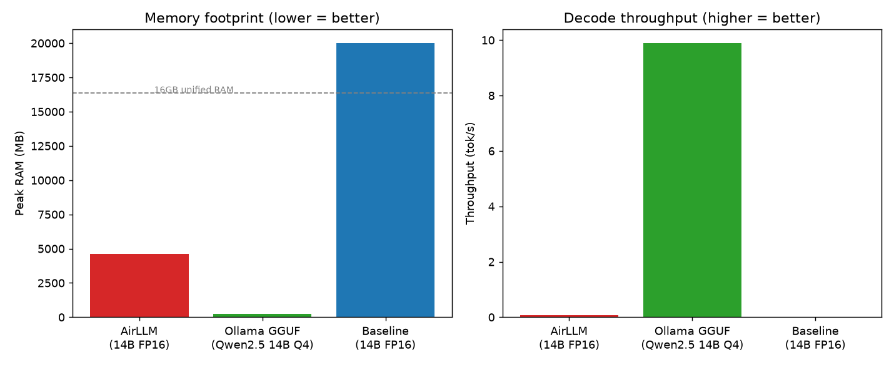
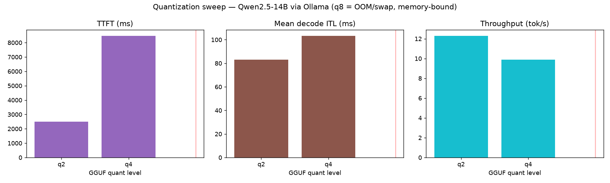
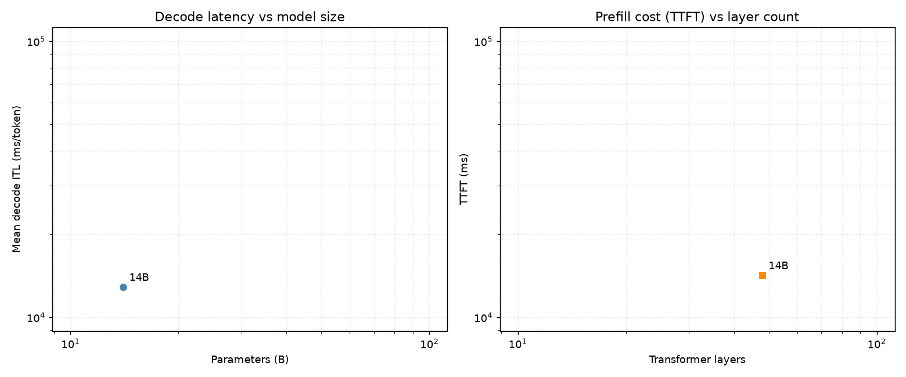
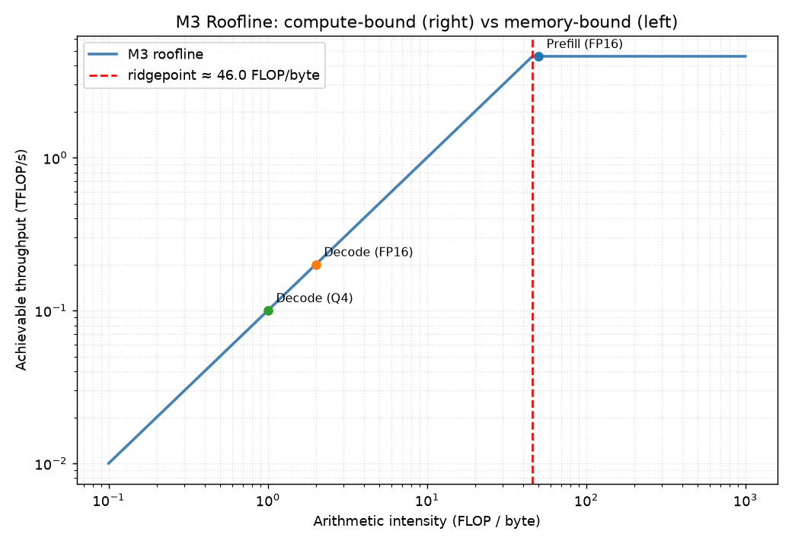
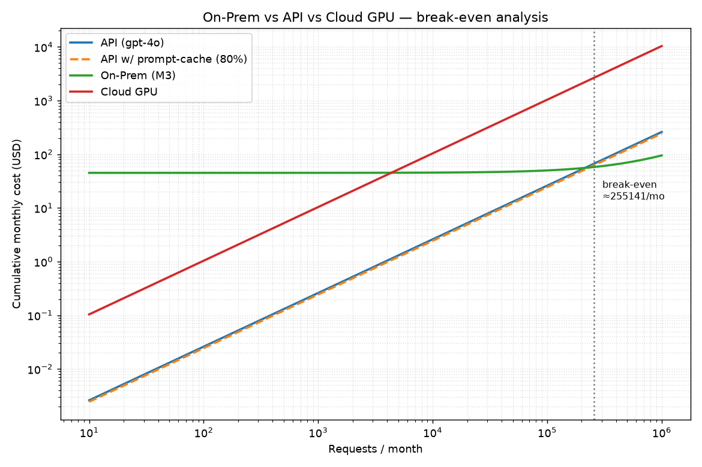

# EX05 — Technical Report (data-driven)

Subject model: **Qwen/Qwen2.5-14B-Instruct**  
Hardware: Apple M3 MacBook Pro, 16 GB unified memory.  
Generated from `results/` Markdown result files.

## 1. Headline comparison (§5.4)

| Path | Peak RAM (MB) | Throughput (tok/s) | Outcome |
|---|---:|---:|---|
| Baseline (FP16) | — | — | OOM / swap thrash |
| AirLLM (FP16) | 4600 | 0.08 | ran, memory-bound |
| Ollama GGUF (Q4) | 259 | 9.89 | ran, comfortable |

## 2. Aggregated results

| scenario | size | quant | ok | ttft_ms | itl_mean_ms | throughput_tps | peak_rss_mb | wall_ms | estimated_kwh |
|---|---|---|---|---|---|---|---|---|---|
| airllm | 14B | fp16 | true | 14170.91 | 12856.19 | 0.08 | 4600.09 | 631324.38 | 7.01 |
| baseline | 14B | — | false | — | — | — | — | 46881.39 | 0.52 |
| ollama | 14b | q2 | true | 2489.79 | 83.10 | 12.29 | 232.53 | 6449.97 | — |
| ollama | 14b | q4 | true | 8471.79 | 103.27 | 9.89 | 259.48 | 13344.13 | 0.15 |
| ollama | 14b | q8 | false | — | — | — | — | 720000 | — |

## 3. Economics — On-Prem vs API (§5.5)

| Path | Latency/req | Break-even vs GPT-4o |
|---|---:|---:|
| Ollama Q4 (~15s) | 15s | 255141 req/mo |
| AirLLM (~600s) | 600s | never |

## 4. Figures

- 
- 
- 
- 
- 

## 5. Reproduction

See `../README.md` §7 for full instructions. Raw per-run data is in `results/`.
